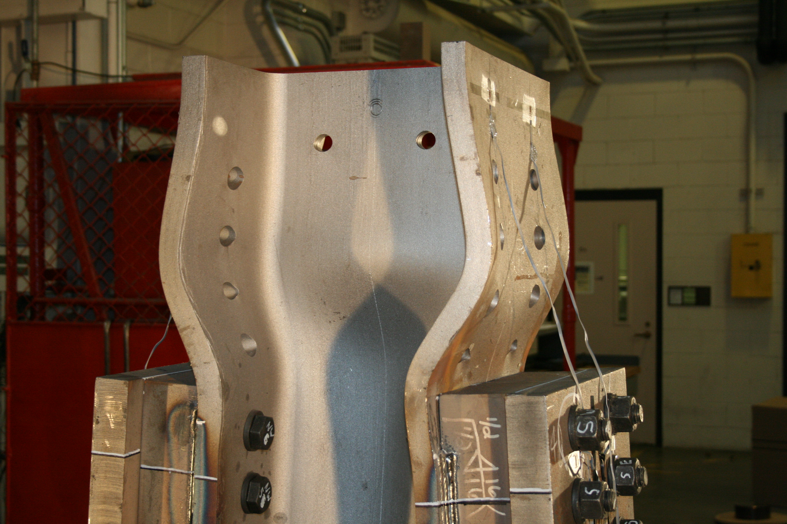

This collection of models features a W8x31 because this wide-flange shape was
used in many previous studies on the stability of structural steel frames,
including in the
[development](https://fsel.engr.utexas.edu/research/publications/details/703110325){target="_blank" rel="noreferrer"}
of the interaction equation that appears in Section H1.1 of the AISC
*Specification* and in the
[verification](https://doi.org/10.1061/(ASCE)0733-9445(2004)130:8(1197)){target="_blank" rel="noreferrer"}
of the direct analysis method.

--------------------------------------------------------------------------------

AISC *Specification* Table C-A-7.1 provides two sets of *K* factors: (1)
theoretical values and (2) recommended design values when ideal conditions are
approximated. It is easy to achieve infinite rotational stiffness at a fixed
support in a finite element analysis, but constructing a real foundation with
infinite stiffness is hard.

--------------------------------------------------------------------------------

In the braced column models, major-axis flexural buckling was found to control. 
What buckling mode would control if the column was a W14x30 instead?

--------------------------------------------------------------------------------

Local buckling will not affect the strength of a column if all the elements are
nonslender, but this doesn't mean that local buckling won't ever occur. The
image below is of a W14x159 which experienced local buckling of the web and
flange after yielding. The column
[reached a peak capacity of 2,720,000 lbs](https://doi.org/10.1016/j.jcsr.2010.10.003){target="_blank" rel="noreferrer"}.

--------------------------------------------------------------------------------

Do you have a fun idea to add to this page? Learn how to contribute it in
[the documentation](../docs/#Adding-a-more-fun-item).
