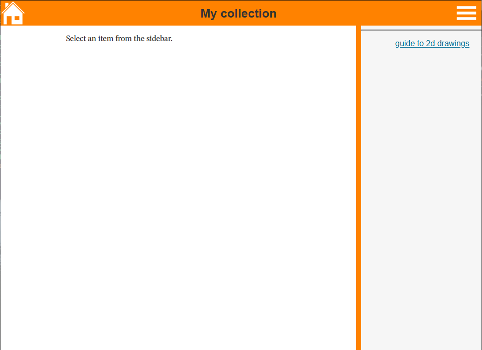
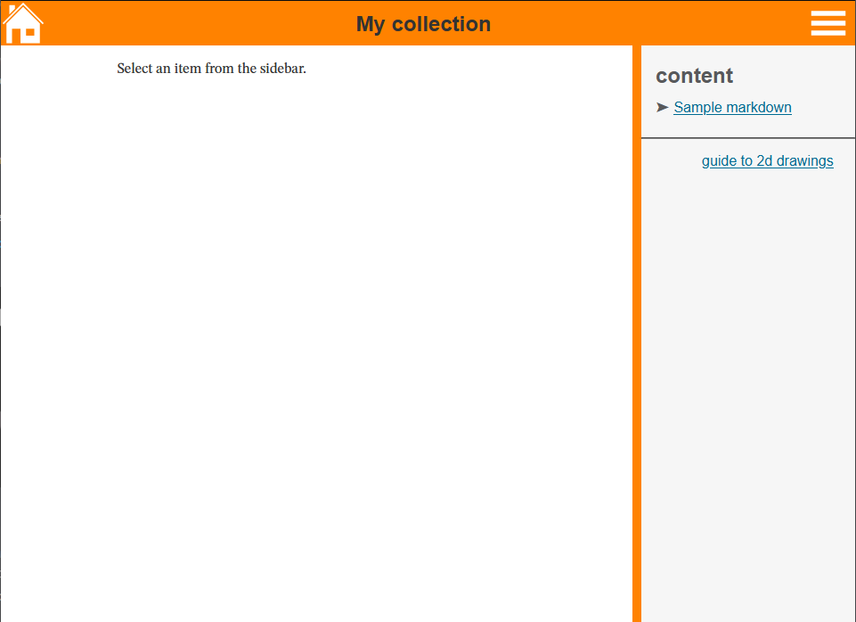
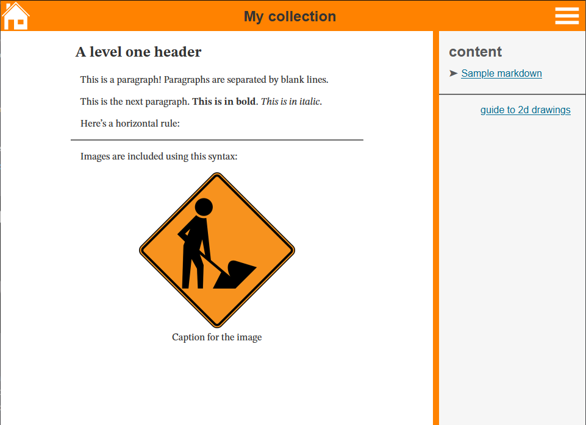
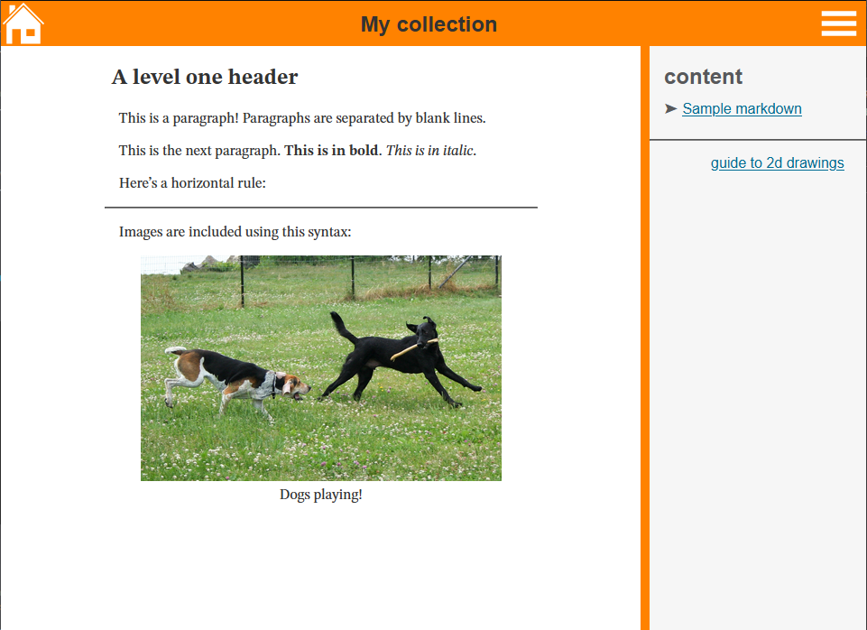

Adding a Collection
===================

In this tutorial, we'll:

- Add a folder and some content for a new collection
- Tell the build system what it needs to know to add the collection to the site
- Link to the collection from the main page

Create the Collection
---------------------

Each collection is gathered in a single folder in the `src` directory. The first
thing we need to do is create a [Typescript](https://www.typescriptlang.org/)
file that will define our collection.

Create a folder for the collection:

``` diff
  src
+ └───my-collection
```

Add a file to `my-collection` called `my-collection.ts`.

``` diff
  src
  └───my-collection
+     └───my-collection.ts
```

Add the following text to `my-collection.ts`:

**my-collection/my-collection.ts**
``` typescript
import { App } from '../app'

new App({
    title: 'My collection',
    groups: [],
})
```

The `App` class is what manages the content of a collection. `title` defines the
name at the top of the page -- on this page, the "Documentation" that you see
along the top.

Next we need to tell the build system to create a new `index.html` page for our
collection. The build system is controlled by the
[`webpack.common.js`](https://github.com/aisc-org/aisc-model-viewer/blob/master/webpack.common.js)
file in the root of the repository. We need to do 2 things:

- Tell webpack to create a new bundle
- Tell webpack to create a new page that uses that bundle.

Bundles are defined by the `entry` object. We need to add a new line pointing to
our `my-collection.ts` file:

**webpack.common.js**
``` diff
  entry: {
      index: './src/index.ts',
      docs: './src/docs/docs.ts',
      guide_to_2d_drawings: './src/guide-to-2d-drawings/guide.ts',
      double_angle: './src/double-angle/double-angle.ts',
+     my_collection: './src/my-collection/my-collection.ts',
      slotted_hss: './src/slotted-hss/slotted-hss.ts',
      wt_plate: './src/wt-plate/wt-plate.ts',
      wf_truss: './src/wf-truss/wf-truss.ts',
  },
```

Next we need to add an `HtmlWebpackPlugin` entry to the `plugins` list. This is
what tells webpack to create an HTML file using the definitions in
`my-collection.ts`.

**webpack.common.js**
``` diff
  plugins: [
+     new HtmlWebpackPlugin({
+         title: 'My collection',
+         filename: 'my-collection/index.html',
+         template: './src/app.ejs',
+         chunks: ['my_collection']
+     })
  ]
```

Let's break this down by its pieces:

- `title` defines the title of the page that appears in the tab in your browser.
- `filename` defines the path to the HTML file relative to the site root. So our
  new collection will be found at `https://aisc-org.github.io/my-collection/`,
  recalling that `index.html` is a special file that is served when the URL
  points to a directory.
- `template` tells webpack which template HTML file to use. All collections
  should use `./src/app.ejs` for their template.
- `chunks` tells webpack which "chunks" of JavaScript to attach to the page. We
  defined a new chunk `my_collection` in the `entry` object above.

If you're building the site locally, now's the time to do so. (If using the dev
server, you'll need to stop and start it again so it picks up the changes to the
webpack configuration.) Navigate to `localhost:8080/my-collection/`, and you
should see something like this:



By default, a link to the [guide to 2d drawings](../guide-to-2d-drawings/) is
added, but nothing else. Let's add some content to the collection.

Adding Content to the Collection
--------------------------------

Most text content on this site is written in
[Pandoc's markdown](https://pandoc.org/MANUAL.html#pandocs-markdown), but you
can write in raw HTML if you prefer. Let's add some now, in the file
`my-collection/sample-markdown.md`.

``` diff
  src
  └───my-collection
      ├───my-collection.ts
+     └───sample-markdown.md
```

**my-collection/sample-markdown.md**
``` markdown
A level one header
==================

This is a paragraph! Paragraphs are separated by blank lines.

This is the next paragraph. **This is in bold**. _This is in italic_.

Here's a horizontal rule:

------------------------------------------------

Images are included using this syntax:


```

After creating this, file, we need to tell the collection to use it. We'll do
that by modifying the `my-collection.ts` file like so:

**my-collection/my-collection.ts**
``` diff
- import { App } from '../app'
+ import { App, HtmlItem } from '../app'
+
+ import sampleMarkdown from './sample-markdown.md'

  new App({
      title: 'My collection',
-     groups: [],
+     groups: [
+         {
+             name: 'content',
+             items: [
+                 new HtmlItem({ name: 'Sample markdown', content: sampleMarkdown }),
+             ]
+         }
+     ]
  })
```

A lot is happening here. Let's break it down. The first line
``` typescript
import { App, HtmlItem } from '../app'
```
imports the `App` and `HtmlItem` classes from `src/app.ts`.


The second line
``` typescript
import sampleMarkdown from './sample-markdown.md'
```

is a webpack-specific way of defining dependencies. A few things
happen when this line is processed:

- The file `sample-markdown.md` is flagged as a dependency.
- From the file extension, webpack knows to parse this file as markdown. It is
  passed through Pandoc and converted to HTML.
- The raw HTML is returned as a string in the variable `sampleMarkdown`.

The `groups` array defines the different groups in the sidebar:

``` typescript
groups: [
    {
        name: 'content',
        items: [
            new HtmlItem({ name: 'Sample markdown', content: sampleMarkdown }),
        ]
    }
]
```

 Each group is a JavaScript object with the fields `name` and `items`. `name` is
 the name that shows up at the top of the group; you can set it to `''` to not
 have a header for your group. `items` is an array of the items that will appear
 in the sidebar. Currently the site supports three kinds, all of which are
 imported from `'../app'`:

- `HtmlItem`, which we use here, defines pages like the one you're reading now;
  content is HTML-based and rendered inside the app.
- `Link`, which adds a link to an external resource.
- `Model`, which is explained in [adding a model](./#Adding-a-model).

Now that we've added our content to the collection, our page looks like this:



And clicking on the new 'Sample markdown' link, we see



The picture used here is a placeholder image found in the `src/assets`
directory. What if we wanted to use a different image? Let's change the
placeholder image to
[this nice one of some dogs playing](https://upload.wikimedia.org/wikipedia/commons/e/ef/American_Foxhound_and_Labrador_Retriever_playing.jpg).
First add the image to the collection directory:

``` diff
  src
  └───my-collection
+     ├───American_Foxhound_and_Labrador_Retriever_playing.jpg
      ├───my-collection.ts
      └───sample-markdown.md
```

Change the link in `sample-markdown.md`:

**my-collection/sample-markdown.md**
``` diff
  A level one header
  ==================
  
  This is a paragraph! Paragraphs are separated by blank lines.
  
  This is the next paragraph. **This is in bold**. _This is in italic_.
  
  Here's a horizontal rule:
  
  ------------------------------------------------
  
  Images are included using this syntax:
  
- 
+ 
```

The final thing we need to do is tell webpack that the image is a dependency. To
do that, we'll add one line to `my-collection.ts`:

**my-collection/my-collection.ts**
``` diff
  import { App, HtmlItem } from '../app'
 
  import sampleMarkdown from './sample-markdown.md'
+ import './American_Foxhound_and_Labrador_Retriever_playing.jpg'

  new App({
      title: 'My collection',
      groups: [
          {
              name: 'content',
              items: [
                  new HtmlItem({ name: 'Sample markdown', content: sampleMarkdown }),
              ]
          }
      ]
  })
```

And now we have a new image for our sample markdown page:


