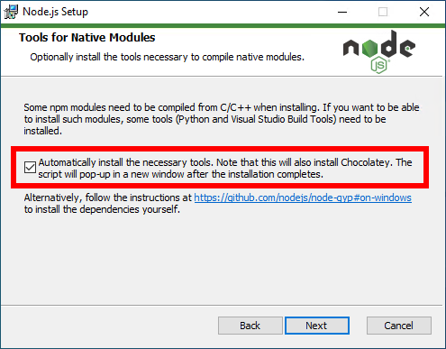

Setting up a Development Environment
====================================

In order to build the website for testing on your own machine, you'll need to
set up a [Node.js](https://nodejs.org) development environment. The site targets
the LTS version of Node (currently major version 12).

Building the site requires the following external dependencies:

- Node.js
- Yarn
- Pandoc, v2.8 or higher. Make sure it's available on your `PATH`.


External Dependencies
---------------------

### Windows

#### Node

Download the latest 12.X release from [the Node.js website](https://nodejs.org).
When installing, make sure to check "Automatically install the necessary tools"
on the "Tools for Native Modules" screen -- or follow the link to the manual
instructions.



#### Yarn

Once Node is installed, run 

``` powershell
npm install -g yarn
```

from an administrator terminal.

#### Pandoc

If you don't already have it installed, and you used the "Automatically install
the necessary tools" option when installing Node, you can easily install Pandoc
by running

``` powershell
choco install -y pandoc
```

from an administrator terminal. If you don't use `choco` to install Pandoc, make
sure that the `pandoc` command is visible on your `PATH`.


### Linux

On Ubuntu, the easiest way to install Node is to use the snap package, which
comes bundled with Yarn:

``` sh
snap install --classic node --channel=12
```

For other distros, download the
[Linux binaries](https://nodejs.org/en/download/) or consult the
[instructions for installing via package manager](https://nodejs.org/en/download/package-manager/).


Other Dependencies
------------------

Once node and yarn are installed, run

```
yarn install
```

To install the rest of the dependencies.


Running the Dev Server
----------------------

Once your development environment is set up, you can run the dev server, which
provides nice things like automatic reloading when a file is changed. Run:

```
yarn start
```

then open a new tab pointing to `localhost:8080`. You'll need to stop and
restart the dev server if you make changes to the webpack configuration.


Building the Site
-----------------

Run

```
yarn build
```

to build the production static site, output into the `dist` folder. You can
run

```
yarn build-dev
```

if you need to build a static version of the development site.
