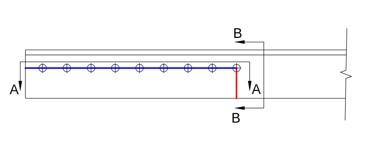

Calculations
============

This page demonstrates calculations to:

-   determine the design strength of the double-angle tension member and bolted
    connection
-   assess the compliance of the connection with geometric limitations

The calculations are based on the 2016 AISC *Specification* and the 15th Edition
AISC *Manual*.
$\newcommand{\inch}{~{\rm{in.}}}
 \newcommand{\kips}{~{\rm{kips}}}
 \newcommand{\ksi}{~{\rm{ksi}}}
 \newcommand{\sixt}{{\tfrac{1}{16}\inch}}$

Material and Geometric Properties
---------------------------------

The geometry of the connection is shown below.

The double-angle tension member and the gusset plate both conform to A36. This
information is typically found in the general notes of the structural drawings.

From AISC *Manual* Table 2-4, the material properties are as follows:

::: properties ::::::::
|                     |
|---------------------|
| ASTM A36            |
| $F_y = 36~\rm{ksi}$ |
| $F_u = 58~\rm{ksi}$ |
:::::::::::::::::::::::

From AISC *Manual* Table 1-7, the geometric properties are as follows:

::: properties ::::::::::::::
|                           |
|---------------------------|
| L6x6x5/8                  |
| $A_g = 7.13~\rm{in.}^2$   |
| $\bar{x} = 1.72~\rm{in.}$ |
:::::::::::::::::::::::::::::

Tensile Yielding
----------------

Calculate the nominal strength using AISC *Specification* Equation D2-1.

$$ \begin{align}
    P_n &= F_y A_g \\
        &= (36~\rm{ksi})(2 \times 7.13~\rm{in.}^2) \\
        &= 513~\rm{kips}
\end{align} $$

Calculate the design strength by applying the resistance factor.

$$ \phi P_n = 0.9(513~\rm{kips}) = 462~\rm{kips}$$

Tensile Rupture
---------------

A depiction of tensile rupture failure for this connection is shown in
[this three-dimensional view](#Tensile-rupture).

The net area, $A_n$, is shown in red. It is equal to the gross area minus the
material removed for two bolt holes as defined in Section B4.3b of the AISC
*Specification*:

$$ \begin{align}
    A_n &= A_g - 2(d_h + \tfrac{1}{16}~\rm{in.})t \\
        &= (2 \times 7.13~\rm{in.}^2) - 2(\tfrac{15}{16}~\rm{in.} + \tfrac{1}{16}~\rm{in.})(\tfrac{5}{8}~\rm{in.}) \\
        &= 13.01~\rm{in.}^2
\end{align} $$

From the description of the element in AISC *Specification* Table D3.1 Case 8,
calculate the shear lag factor, U, as the larger of the values from Case 2 and
Case 8.

Case 2, where $l$ is the length of connection from the centerline of the first
bolt to centerline of the last bolt.

$$ \begin{align}
    U &= 1 - \frac{\bar{x}}{l} \\
      &= 1 - \frac{1.72~\rm{in.}}{24~\rm{in.}} \\
      &= 0.928
\end{align} $$

Case 8.

$$ U = 0.8 $$

Therefore, use the larger $U = 0.928$.

Calculate the effective net area using AISC *Specification* Equation D3-1.

$$ \begin{align}
    A_e &= A_n U \\
        &= (13.01~\rm{in.}^2)(0.928) \\
        &= 12.07~\rm{in.}^2
\end{align} $$

Calculate the nominal strength using AISC *Specification* Equation D2-2.

$$ \begin{align}
    P_n &= F_u A_e \\
        &= (58~\rm{ksi})(12.07~\rm{in.}^2) \\
        &= 700~\rm{kips}
\end{align} $$

Calculate the design strength by applying the resistance factor.

$$ \phi P_n = 0.75(700~\rm{kips}) = 525~\rm{kips}$$

Block Shear Rupture
-------------------

The only valid and plausible block shear rupture failure path is shown below.
See also the [3D view of this failure mode](#Block-shear-rupture).

Calculate the gross area subject to shear.

$$ \begin{align}
    A_{gv} &= 2 \times (26\tfrac{1}{8}~\rm{in.})(\tfrac{5}{8}~\rm{in.}) \\
            &= 32.66~\rm{in.}^2
\end{align} $$

Calculate the net area subject to shear as gross area subject to shear minus the
material removed for eight and a half bolt holes on each angle.

$$ \begin{align}
    A_{nv} &= A_{gv} - 2 \times 8\tfrac{1}{2} \times (d_h + \tfrac{1}{16}~\rm{in.})t \\
            &= 32.66~\rm{in.}^2 - 2 \times 8\tfrac{1}{2} \times (\tfrac{15}{16}~\rm{in.} + \tfrac{1}{16}~\rm{in.})(\tfrac{5}{8}~\rm{in.}) \\
            &= 22.04~\rm{in.}^2
\end{align} $$

Calculate the gross area subject to tension.

$$ \begin{align}
    A_{gt} &= 2 \times (3\tfrac{3}{4}~\rm{in.})(\tfrac{5}{8}~\rm{in.}) \\
            &= 4.69~\rm{in.}^2
\end{align} $$

Calculate the net area subject to tension as gross area subject to tension minus
the material removed for one half bolt hole on each angle.

$$ \begin{align}
    A_{nt} &= A_{gt} - 2 \times \tfrac{1}{2} \times (d_h + \tfrac{1}{16}~\rm{in.})t \\
            &= 4.69~\rm{in.}^2 - 2 \times \tfrac{1}{2} \times (\tfrac{15}{16}~\rm{in.} + \tfrac{1}{16}~\rm{in.})(\tfrac{5}{8}~\rm{in.}) \\
            &= 4.07~\rm{in.}^2
\end{align} $$

Calculate the nominal strength using AISC *Specification* Equation J4-5. Take
$U_{bs} = 1.0$

$$ \begin{align}
    P_n &= 0.6 F_u A_{nv} + U_{bs} F_u A_{nt} \leq 0.6 F_y A_{gv} + U_{bs} F_u A_{nt} \\
        &= 0.6 (58~\rm{ksi}) (22.04~\rm{in.}^2) + (1.0)(58~\rm{ksi}) (4.07~\rm{in.}^2)\\
        &\;\;\;\leq 0.6 (36~\rm{ksi}) (32.66~\rm{in.}^2) + (1.0)(58~\rm{ksi}) (4.07~\rm{in.}^2)\\
        &= 1003~\rm{kips} \leq 942~\rm{kips} \\
        &= 942~\rm{kips}
\end{align} $$

Calculate the design strength by applying the resistance factor.

$$ \phi P_n = 0.75(942~\rm{kips}) = 706~\rm{kips}$$

Bolt Group Strength
-------------------

The limit states of bolt shear rupture, bearing, and tearout are evaluated
together to determine the design strength of the bolt group.

For each bolt, an effective strength is calculated as the lowest strength from
the limit states of bolt shear rupture, bearing, and tearout.

From AISC *Specification* Table J3.2, Group A bolts, when threads are not
excluded from shear planes:

$F_{nv} = 54~\rm{ksi}$

Calculate the nominal unthreaded body area of of bolt.

$$ \begin{align}
    A_b &= \tfrac{\pi}{4} d^2 \\
        &= \tfrac{\pi}{4}(\tfrac{7}{8}~\rm{in.})^2 \\
        &= 0.601~\rm{in.}^2
\end{align} $$

### Bolt \#1

Calculate the nominal strength for the limit state of bolt shear rupture using
AISC *Specification* Equation J3-1. Note that the bolts are in double shear.

$$ \begin{align}
    r_n &= F_{nv} A_b \\
        &= (54~\rm{ksi})(2 \times 0.601~\rm{in.}^2) \\
        &= 64.9~\rm{kips}
\end{align} $$

Calculate the nominal strength for the limit state of bearing in the double
angle using AISC *Specification* Equation J3-6a.

$$ \begin{align}
    r_n &= 2.4dtF_u \\
        &= 2.4(\tfrac{7}{8}~\rm{in.})(2 \times \tfrac{5}{8}~\rm{in.})(58~\rm{ksi}) \\
        &= 152.3~\rm{kips}
\end{align} $$

Calculate the nominal strength for the limit state of bearing in the gusset
plate using AISC *Specification* Equation J3-6a.

$$ \begin{align}
    r_n &= 2.4dtF_u \\
        &= 2.4(\tfrac{7}{8}~\rm{in.})(\tfrac{1}{2}~\rm{in.})(58~\rm{ksi}) \\
        &= 60.9~\rm{kips}
\end{align} $$

Calculate the nominal strength for the limit state of tearout in the double
angle using AISC *Specification* Equation J3-6c.

$$ \begin{align}
    l_c &= 2\tfrac{1}{8}~\rm{in.} - \tfrac{1}{2}d_h \\
        &= 2\tfrac{1}{8}~\rm{in.} - \tfrac{1}{2}(\tfrac{15}{16}~\rm{in.}) \\
        &= 1.656~\rm{in.}
\end{align} $$

$$ \begin{align}
    r_n &= 1.2l_ctF_u \\
        &= 1.2(1.656~\rm{in.})(2 \times \tfrac{5}{8}~\rm{in.})(58~\rm{ksi}) \\
        &= 144.1~\rm{kips}
\end{align} $$

Calculate the nominal strength for the limit state of tearout in the gusset
plate using AISC *Specification* Equation J3-6c.

$$ \begin{align}
    l_c &= 3~\rm{in.} - d_h \\
        &= 3~\rm{in.} - \tfrac{15}{16}~\rm{in.} \\
        &= 2.063~\rm{in.}
\end{align} $$

$$ \begin{align}
    r_n &= 1.2l_ctF_u \\
        &= 1.2(2.063~\rm{in.})(\tfrac{1}{2}~\rm{in.})(58~\rm{ksi}) \\
        &= 71.2~\rm{kips}
\end{align} $$

Bearing in the gusset plate controls. The nominal effective strength of bolt \#1
is 60.9 kips.

### Bolts \#2-8

The effective strength of bolts \#2 through \#8 is calculated in the same
manner, except the clear distance for tearout is the same for both the plate and
the double angle:

$$ \begin{align}
    l_c &= 3\inch - d_h = 2.063\inch
\end{align} $$

Bearing in the gusset plate controls. The nominal effective strength of bolts
\#2 through \#8 is 60.9 kips.

### Bolt \#9

The effective strength of bolt \#9 is calculated in the same manner, except with
different clear distances:

$$ \begin{align}
    l_{c,\text{ angle}} &= 3\inch - d_h = 2.063\inch \\
    l_{c,\text{ plate}} &= 0.882\inch \text{ (see figure)}
\end{align} $$

Tearout in the gusset plate controls. The nominal effective strength of bolt \#9
is 30.7 kips.

### Bolt Group

Calculate the nominal effective strength of the bolt group by summing the
nominal effective strength of each bolt.

$$ \begin{align}
    R_n &= 60.9~\rm{kips} + 7 \times 60.9~\rm{kips} + 30.7~\rm{kips} \\
        &= 518~\rm{kips}
\end{align} $$

Calculate the design strength by applying the resistance factor.

$$ \phi P_n = 0.75(518~\rm{kips}) = 388~\rm{kips}$$

Design Strength
---------------

The design strength of the double-angle tension member and bolted connection for
each of the limit states investigated is summarized in the following table.

  Limit state                                Design strength
  ------------------------------------------ -----------------
  Tensile yielding                           462 kips
  Tensile rupture                            525 kips
  Block shear rupture                        706 kips
  Bolt shear rupture, bearing, and tearout   388 kips

**Bolt group strength controls with a design strength of 388 kips.**

Bolt Spacing
------------

From Section J3.3 of the AISC *Specification*, the minimum spacing between bolts
is $2\tfrac{2}{3}d$.

$$ \begin{align}
    s_{min} &= 2\tfrac{2}{3}d \\
            &= 2\tfrac{2}{3}(\tfrac{7}{8}~\rm{in.}) \\
            &= 2.33~\rm{in.}
\end{align} $$

From the User Note in Section J3.3 of the AISC *Specification*, the preferred
minimum spacing between bolts is $3d$.

$$ \begin{align}
    s_{min} &= 3d \\
            &= 3(\tfrac{7}{8}~\rm{in.}) \\
            &= 2.63~\rm{in.}
\end{align} $$

From Section J3.5 of the AISC *Specification* and noting that the members are
painted, the maximum spacing between bolts is the lesser of 24 times the
thickness of the thinner part jointed and 12 in.

$$ \begin{align}
    s_{max} &= min(24t_{min},12~\rm{in.}) \\
            &= min(24(\tfrac{5}{8}~\rm{in.}),12~\rm{in.}) \\
            &= 12~\rm{in.}
\end{align} $$

The provided spacing between bolts is 3 in. which satisfies the required minimum
spacing, preferred minimum spacing, and the maximum spacing.

Bolt Edge Distances
-------------------

From Section J3.4 and Table J3.4 of the AISC *Specification*, the
minimum edge distance for a 7/8 in. diameter bolt in a standard hole is
$1\tfrac{1}{8}~\rm{in.}$

The minimum provided edge distance is $2\tfrac{1}{8}~\rm{in.}$ which
satisfies the minimum edge distance requirement.

From Section J3.5 of the AISC *Specification*, the maximum spacing between bolts
is the lesser of 12 times the thickness of the connected part and 6 in.

$$ \begin{align}
    L_{e,\max} &= \min(12t_{\min},6~\rm{in.}) \\
               &= \min(12(\tfrac{1}{2}~\rm{in.}),6~\rm{in.}) \\
               &= 6~\rm{in.}
\end{align} $$

The maximum provided edge distance is $3\tfrac{3}{4}~\rm{in.}$ which
satisfies the maximum edge distance requirement.

Entering and Tightning Clearances
---------------------------------

From Table 7-15 of the AISC *Manual*, the minimum distance from the center of a
7/8 in. diameter A325 bolt and the face of a vertical obstruction is

$$1\tfrac{1}{4}~\rm{in.}$$

The distance between the center of the bolts and the face of the outstanding leg
of the angles is

$$2\tfrac{1}{4}~\rm{in.} - t = 2\tfrac{1}{4}~\rm{in.} - \tfrac{5}{8}~\rm{in.} = 1\tfrac{5}{8}~\rm{in.}$$

The provided clearance exceeds the minimum required clearance, therefore the
outstanding leg of the angle will not interfere with the installation of the
bolts.
