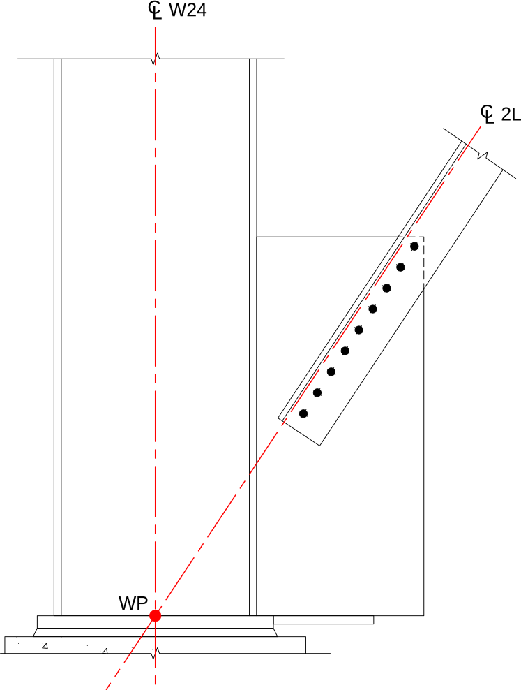

This connection can be found in the real world in Neyland Stadium. Check it out
at
[35°57\'19.8\"N 83°55\'26.9\"W](https://www.google.com/maps/place/35%C2%B057'19.8%22N+83%C2%B055'26.9%22W).
Go Vols!

------------------------------------------------------------------------

The column is a W24x130. You won't find this section in the 15th Edition of the
Steel Construction Manual since it is no longer commonly produced. It last
appeared in the
[7th Edition (PDF)](https://www.aisc.org/globalassets/aisc/publications/historic-steel-construction-manuals/r07-04_5859.pdf).
If you are looking for information on historical shapes, AISC's
[Design Guide 15](https://www.aisc.org/products/publication/design-guide/Design-Guide-15-Rehabilitation-and-Retrofit-Second-Edition/)
is a good place to start. PDF versions of all the Design Guides are free for
AISC members -- including student members!

------------------------------------------------------------------------

The *work point* of a connection is where the center line of the connected
members meet. It is common for this to be at the top of the base plate. The work
point of this connection is shown below, with the member centerlines in red:

