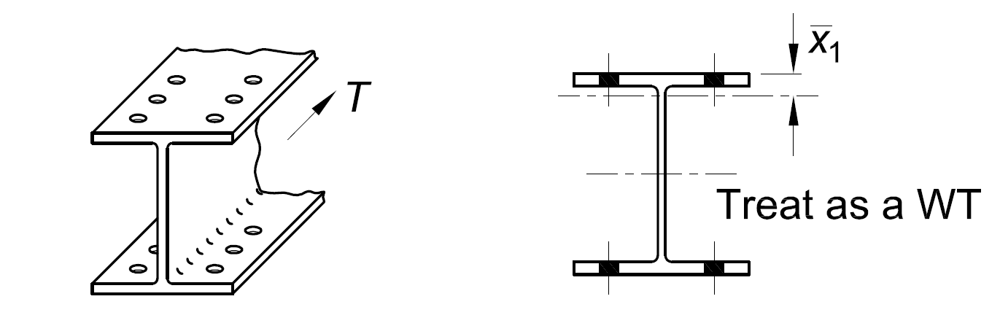

How were you supposed to know to treat the wide flange as two WTs for calculation 
of the shear lag factor, U? It is not clear in Table D3.1 of the AISC *Specification*, 
but it is crystal clear in the commentary. The figure below is from the commentary 
on Chapter D. The commentary (the pages with grey edges in the AISC *Manual*) has 
lots of information and is a good first place to look for any question about the 
*Specification*. 

--------------------------------------------------------------------------------

Oversize holes make fit up easier. What would change about the strength calculations 
if oversize holes were used in this connection?

--------------------------------------------------------------------------------

Gusset plates are important. A design error resulting in a gusset plate that was 
too thin was [cited]( https://www.ntsb.gov/investigations/AccidentReports/Reports/HAR0803.pdf) 
as the cause of the I-35W Highway Bridge Collapse in Minneapolis in 2007. 

--------------------------------------------------------------------------------

The wide flanges in this connection are all W12, but they don’t have the exact 
same depth. Filler plates are used to make up the difference. However, research 
has shown that filler plates can reduce the strength of bolted connections. 
Requirements for fillers are located in Section J5 of the AISC *Specification*. 

--------------------------------------------------------------------------------

Do you have a fun idea to add to this page? Learn how to contribute it in [the documentation](../docs/#Adding-a-more-fun-item).
