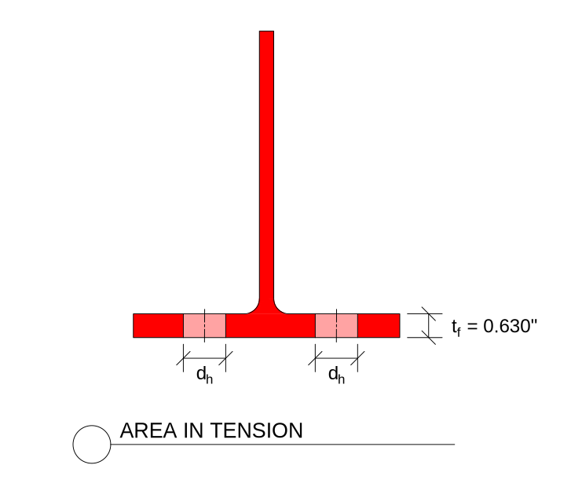
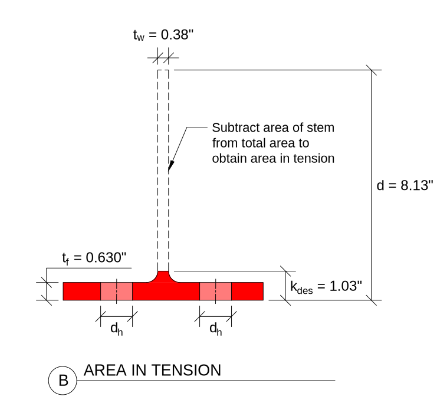
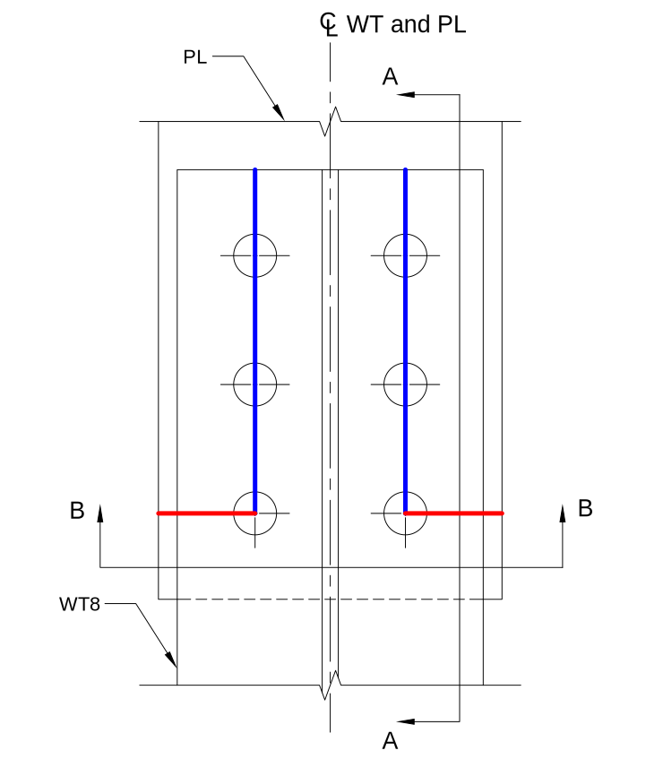
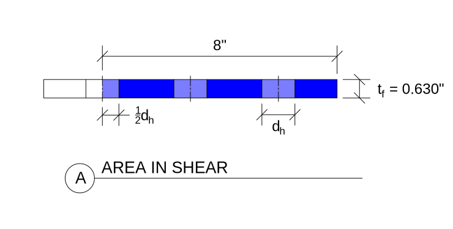
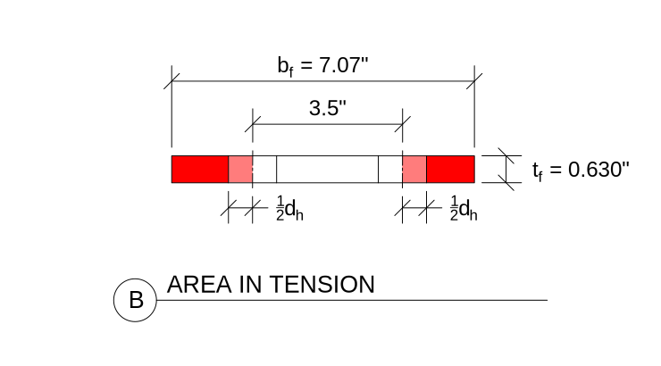
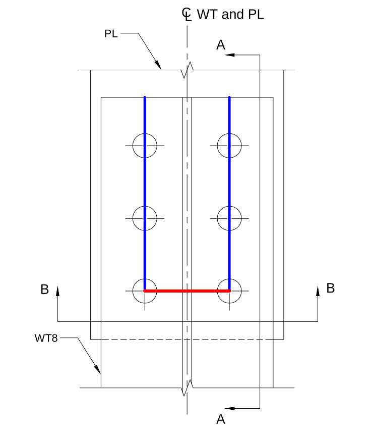
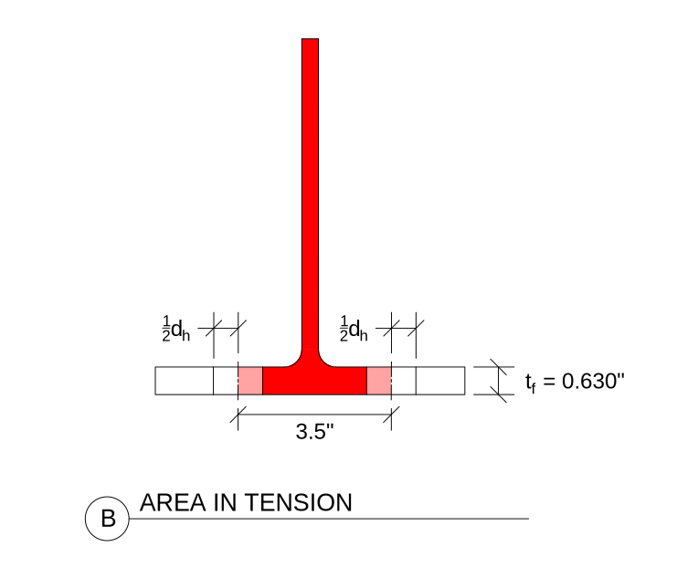

Calculations
============

This page demonstrates calculations to determine the design strength of the WT
tension member, considering the limit states of:

- Tensile yielding
- Tensile rupture
- Block shear rupture

The calculations are based on the 2016 AISC *Specification* and the 15th edition
AISC *Manual*.
$\newcommand{\inch}{~{\rm{in.}}}
 \newcommand{\kips}{~{\rm{kips}}}
 \newcommand{\ksi}{~{\rm{ksi}}}
 \newcommand{\sixt}{{\tfrac{1}{16}\inch}}$

Material and Geometric Properties
---------------------------------

The connection consists of a WT8x25 with the flange connected by six (6)
1" diameter A490X bolts to a 1" plate.

Typically, the material specifications for each type of steel shape used on a project
are listed on the general notes sheet of the structural drawings. For this case,
the WT conforms to ASTM A992.

From AISC *Manual* Table 2-4, the material properties for the WT are as follows:

::: properties :::
|                |
|----------------|
| ASTM A992      |
| $F_y = 50\ksi$ |
| $F_u = 65\ksi$ |
::::::::::::::::::

From AISC *Manual* Table 1-8, the geometric properties are as follows:

::: properties ::::::::::::::::::::::::::::::::::::::::::::::::::::::::::::::::
|                           |                        |                        |
|---------------------------|------------------------|------------------------|
| WT8x25                    |                        |                        |
| $A_g = 7.37~\rm{in.}^2$   | $t_f = 0.630~\rm{in.}$ | $d = 8.13~\rm{in.}$    |
| $\bar{y} = 1.89~\rm{in.}$ | $b_f = 7.07~\rm{in.}$  | $t_w = 0.380~\rm{in.}$ |
:::::::::::::::::::::::::::::::::::::::::::::::::::::::::::::::::::::::::::::::

Tensile Yielding
----------------

Calculate the nominal strength using AISC *Specification* Equation D2-1.

$$ \begin{align}
    P_n &= F_y A_g \\
        &= (50 \text{ ksi})(7.37 \text{ in.}^2) \\
        &= 368 \text{ kips}
\end{align} $$

Calculate the design strength by applying the resistance factor.

$$
    \phi P_n = 0.9 (368 \text { kips}) \boxed{= 332 \text{ kips}}
$$

Tensile Rupture
---------------

Steps:

- Calculate net area $A_n$
- Calculate shear lag factor $U$ and effective net area $A_e$
- Calculate tensile rupture strength

A depiction of tensile rupture failure for this connection is shown in
[this three-dimensional view](#Tensile-rupture).

The net area, $A_n$, is shown in red. It is equal to the gross area minus the
material removed for two bolt holes as defined in Section B4.3b of the AISC
*Specification*.

$$ \begin{align}
    A_n &= A_g - 2(d_h + \tfrac{1}{16}\text{ in.}) t_f \\
        &= 7.37 \text{ in.}^2 - 2 (1 \tfrac{1}{8} \text{ in.}
           + \tfrac{1}{16}\text{ in.}) (0.630 \text{ in.}) \\
        &= 5.87 \text{ in.}^2
\end{align} $$

From the description of the element in AISC *Specification* Table D3.1 Case 2,
calculate the shear lag factor $U$ as the larger of the values from Case 2 and
Case 7.

Case 2, where:

- $\bar{x}$ is $\bar{y}$ from AISC *Manual* Table 1-9.
- $l$ is the length of the connection, in the direction of the force, from the
  centerline of the first row of bolts to the centerline of the last row of bolts

$$ \begin{align}
    U &= 1 - \frac{\bar{x}}{l} \\
      &= 1 - \frac{1.89 \text{ in.}}{6 \text{ in.}} \\
      &= 0.685
\end{align}$$

Case 7; flange has three fasteners per line in the direction of loading:

$$ \begin{align}
    b_f &= 7.07\text{ in.} \\
    \tfrac23 d &= \tfrac23 (8.13\text{ in.}) = 5.42\text{ in.} \\
    b_f &\ge \tfrac23 d \Rightarrow \boxed{U = 0.90}
\end{align} $$

Use the larger $U = 0.90$.

Calculate the effective net area using AISC *Specification* Equation D3-1:

$$ A_e = A_n U = (5.87 \text{ in.}^2) (0.90) = 5.29 \text{ in.}^2 $$

Calculate the nominal strength using AISC *Specification* Equation D2-2:

$$ \begin{align}
    P_n &= F_u A_e \\
        &= (65 \text{ ksi})(5.29 \text{ in.}^2) \\
        &= 344 \text{ kips}
\end{align} $$

Calculate the design strength by applying the resistance factor.

$$\phi P_n = 0.75 (344 \text{ kips}) \boxed{= 258 \text{ kips}}$$

Block Shear
-----------

There are three plausible block shear paths for this connection:

1. [Tension in the flange and shear in the stem](#Block-shear-1)
2. [Tension in the outside of the flange and shear along the bolt lines](#Block-shear-2)
3. [Tension in the stem and the inside of the flange and shear along the bolt lines](#Block-shear-3)

All plausible paths have uniform tension stress, so $U_{bs} = 1.0$ for all.

### Block Shear 1 ([model](#Block-shear-1))

The shear plane is in the stem at the toe of the fillet. Since there is no material
removed (e.g., bolt holes), the gross and net shear areas $A_{gv}$ and $A_{nv}$ are
the same:

$$ \begin{align}
    A_{gv} = A_{nv} &= t_w (8 \text{ in.}) \\
                    &= (0.380 \text{ in.})(8 \text{ in.}) \\
                    &= 3.04 \text{ in.}^2
\end{align} $$

The gross area subject to tension is most easily calculated by subtracting the
area of the stem from the gross area of the WT:

$$ \begin{align}
    A_{gt} &= A - t_w (d - k_{des}) \\
           &= 7.37 \text{ in.}^2 - (0.380 \text{ in.})(
               8.13 \text{ in.} - 1.03 \text{ in.}) \\
           &= 4.67 \text{ in.}^2
\end{align} $$

Calculate the net area subject to tension.

$$ \begin{align}
    A_{nt} &= A_{gt} - 2(d_h + \tfrac{1}{16}\text{ in.}) t_f \\
           &= 4.67 \text{ in.}^2 - 2 (1 \tfrac{1}{8} \text{ in.}
              + \tfrac{1}{16}\text{ in.}) (0.630 \text{ in.}) \\
           &= 3.18 \text{ in.}^2
\end{align} $$

Calculate the nominal strength using AISC *Specification* Equation J4-5. Since
$A_{gv} = A_{nv}$, the strength with shear yield will control over the strength
with shear rupture.

$$ \begin{align}
    R_n &= 0.60 F_y A_{gv} + U_{bs} F_u A_{nt} \\
        &= 0.60 (50\text{ ksi})(3.04\text{ in.}^2) + 1.0 (65\text{ ksi})
           (3.18 \text{ in.}^2)\\
        &\boxed{= 298 \text{ kips}}
\end{align} $$

### Block Shear 2 ([model](#Block-shear-2))

Calculate the gross area subject to shear.

$$ \begin{align}
    A_{gv} &= 2 t_f (8 \text{ in.}) \\
           &= 2 (0.630 \text{ in.}) (8 \text{ in.}) \\
           &= 10.1 \text{ in.}^2
\end{align} $$

Calculate the net area by removing the material from 4 whole bolt holes and
2 half bolt holes.

$$ \begin{align}
    A_{nv} &= A_{gv} - 5 (d_h + \tfrac{1}{16}\text{ in.}) t_f \\
           &= 10.1 \text{ in.}^2 - 5 (1 \tfrac18 \text{ in.}
              + \tfrac{1}{16}\text{ in.}) (0.630 \text{ in.}) \\
           &= 6.34 \text{ in.}^2
\end{align} $$

Calculate the gross area subject to tension.

$$ \begin{align}
    A_{gt} &= (b_f - 3.5\text{ in.}) t_f \\
           &= (7.07\text{ in.} - 3.5\text{ in.}) (0.630 \text{ in.}) \\
           &= 2.25 \text{ in.}^2
\end{align} $$

Calculate the net area subject to tension.

$$ \begin{align}
    A_{nt} &= A_{gt} - (d_h + \tfrac{1}{16}\text{ in.}) t_f \\
           &= 2.25 \text{ in.}^2 - (1 \tfrac18 \text{ in.}
              + \tfrac{1}{16}\text{ in.}) (0.630 \text{ in.}) \\
           &= 1.50 \text{ in.}^2
\end{align} $$

Calculate the nominal block shear strength.

$$ \begin{align}
    R_n &= 0.60 F_u A_{nv} + U_{bs} F_u A_{nt} \le
           0.60 F_y A_{gv} + U_{bs} F_u A_{nt} \\
        &= 0.60 (65\text{ ksi}) (6.34 \text{ in.}^2)
           + 1.0 (65\text{ ksi}) (1.50 \text{ in.}^2) \\
           &\quad\le
           0.60 (50\text{ ksi}) (10.1 \text{ in.}^2)
           + 1.0 (65\text{ ksi}) (1.50 \text{ in.}^2) \\
        &= 247\text{ kips} + 97.5\text{ kips} \le 303\text{ kips} + 97.5\text{ kips} \\
        &\boxed{= 345\text{ kips}}
\end{align} $$

### Block Shear 3 ([model](#Block-shear-3))

The gross and net areas subject to shear are the same as for block shear 2.

$$ \begin{align}
    A_{gv} &= 10.1 \text{ in.}^2\\
    A_{nv} &= 6.34 \text{ in.}^2
\end{align} $$

Calculate the gross area subject to tension.

$$ \begin{align}
    A_{gt} &= A - (b_f - 3.5\text{ in.}) t_f \\
           &= 7.37 \text{ in.}^2 - (7.07\text{ in.}
              - 3.5\text{ in.}) (0.630 \text{ in.}) \\
           &= 5.12 \text{ in.}^2
\end{align} $$

Calculate the net area subject to tension.

$$ \begin{align}
    A_{nt} &= A_{gt} - (d_h + \tfrac{1}{16}\text{ in.}) t_f \\
           &= 5.12 \text{ in.}^2 - (1 \tfrac18 \text{ in.}
              + \tfrac{1}{16}\text{ in.}) (0.630 \text{ in.}) \\
           &= 4.37 \text{ in.}^2
\end{align} $$

Calculate the nominal block shear strength.

$$ \begin{align}
    R_n &= 0.60 F_u A_{nv} + U_{bs} F_u A_{nt} \le
           0.60 F_y A_{gv} + U_{bs} F_u A_{nt} \\
        &= 0.60 (65\text{ ksi}) (6.34 \text{ in.}^2)
           + 1.0 (65\text{ ksi}) (5.12 \text{ in.}^2) \\
           &\quad\le
           0.60 (50\text{ ksi}) (10.1 \text{ in.}^2)
           + 1.0 (65\text{ ksi}) (5.12 \text{ in.}^2) \\
        &= 247\text{ kips} + 333\text{ kips} \le 303\text{ kips} + 333\text{ kips} \\
        &\boxed{= 531\text{ kips}}
\end{align} $$

### Block Shear Summary

The controlling nominal strength is from block shear 1, with
$R_n = 298\text{ kips}$. Calculate the design strength by applying the
resistance factor.

$$ \begin{align}
    \phi R_n &= 0.75 (298\text{ kips}) \\
             &\boxed{= 223\text{ kips}}
\end{align} $$

Limit State Summary
-------------------

The design tensile strength of the WT member is summarized in the following
table.

: Tensile limit state summary

| Limit state         | Design strength |
|:--------------------|----------------:|
| Tensile yielding    |        332 kips |
| Tensile rupture     |        258 kips |
| Block shear rupture |        223 kips |

**Block shear rupture controls with a design strength of 223 kips.**
