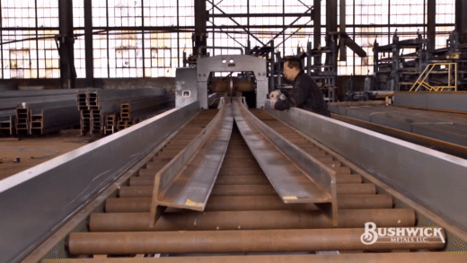
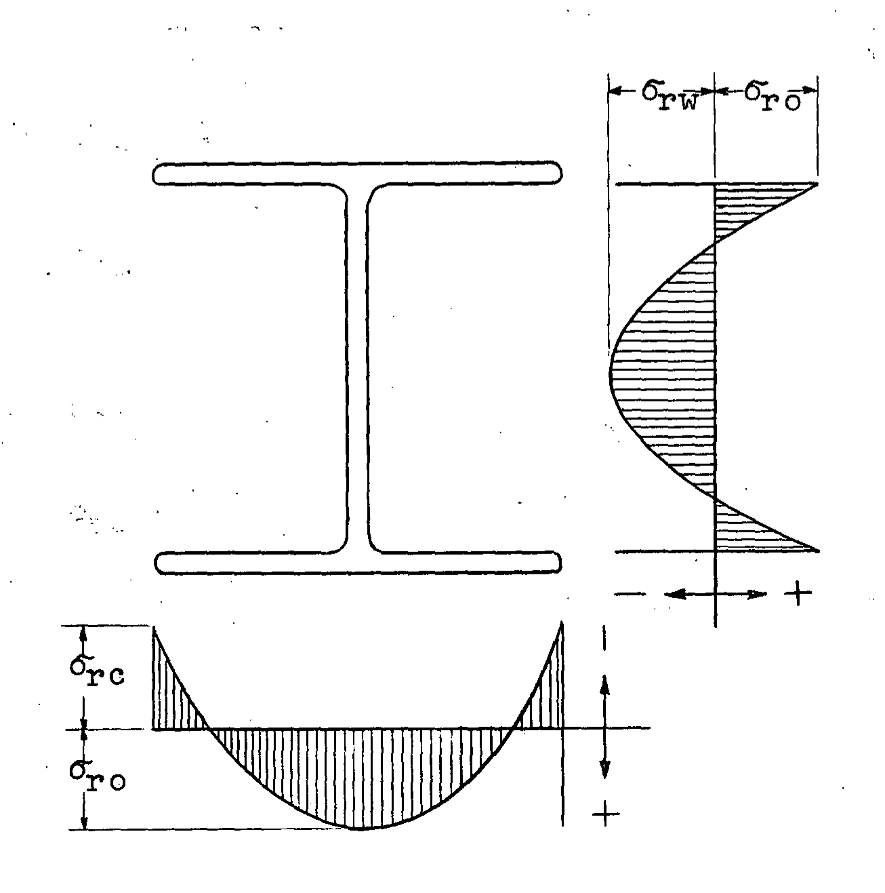

What would be the controlling limit state if the WT as a WT#x##?

    
Hint

    Here's a hint!

    
Answer

    Simplified calculations...

-----------------------------------

Link to the paper that we found discussing this weird block shear pattern.

-----------------------------------

There are a lot of limit states even for this one connection.
If you are unsure which controls, or if you are writing a design spreadsheet, it is a good idea to check them all.
With experience, you will gain a feel for which states control and limit your calculations.
Here's a list of the strength limit states that apply to this connection (* = covered here):

- *Tensile yield of the WT
- *Tensile rupture of the WT
- *Block shear rupture of the WT (multiple plausible failure paths)
- Tensile yield of the plate
- Tensile rupture of the plate
- Block shear rupture of the plate
- Bolt shear rupture
- Bolt bearing and tearout
- Bolt slip (if slip critical)

Connections are important also to serviceability limit states;
Chapter L of the AISC *Specification*,
which defines the (very broad) requirements for serviceability design,
specifically calls out connection slip as a condition to check.

-----------------------------------

WTs are made by cutting a wide flange section lengthwise, either in a dedicated shop
or at the jobsite itself.
They are rarely, if ever, hot-rolled as separate sections.
The cut can be achieved in a variety of ways.
Due to residual stresses in the W section, the two pieces will actually bend
and may need to be straightened:

<figure>
    
    <figcaption>Bending of tee as the source W section is cut. \[[Source](https://www.youtube.com/watch?v=x3qNUgCmbDY)\]</figcaption>
</figure>

The residual stresses are caused by differential cooling in the wide flange section.
As the beam is cut, the residual stresses mean the two pieces are no longer in equilibrium.

<figure>
    
    <figcaption>Idealized parabolic residual stress distribution (Feder and Lee, 1959)</figcaption>
</figure>

The stress pattern is commonly called the Lehigh stress pattern,
named after [the university](https://en.wikipedia.org/wiki/Lehigh_University) where many residual stress experiments were performed.
